# chapter 1: The first steps with gen-AI

## Introduction
To follow the scenario of the workshop, you will need the powerpoint presentation shown in the workshop. This will be available under the following link: [TODO](https://...)

This part will be mainly in the watsonx UI. So there will be no code to run.

If you want to see an in depth explanation of the content of this chapter, you can also refer to this youtube [video](https://www.youtube.com/watch?v=ztdsheuziVA&ab_channel=MaximilianJesch)
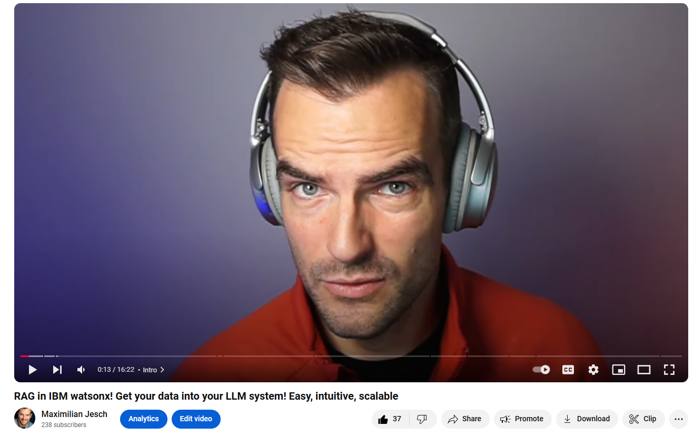

## Basics: RAG 101

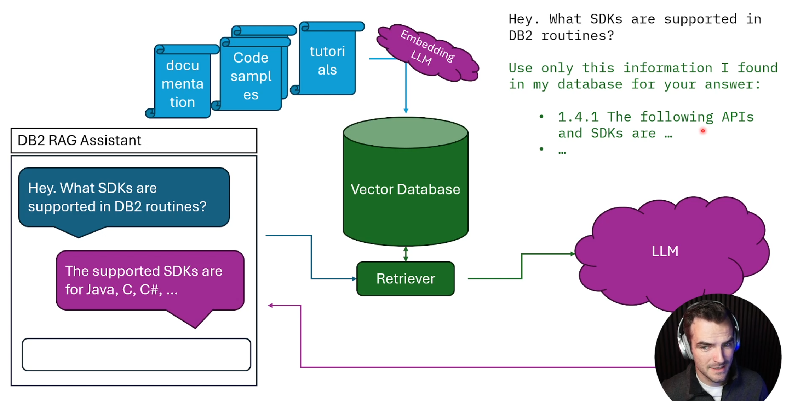

Please refer to the slides for the detailed explanation of the RAG concept.These will be available under the following link: [TODO](https://...)

## Step by Step

This is one of many ways to setup a RAG system. The following steps will guide you through the process of setting up a RAG system using the watsonx UI. The beauty of this approach is that it is easy to get started and you can replace components of the system as your application grows.

### 1. Chat with your documents

#### 1.1. Upload your documents

Open your project and click on "new asset" and then on "prompt lab".

Click the "upload" button to upload your documents.

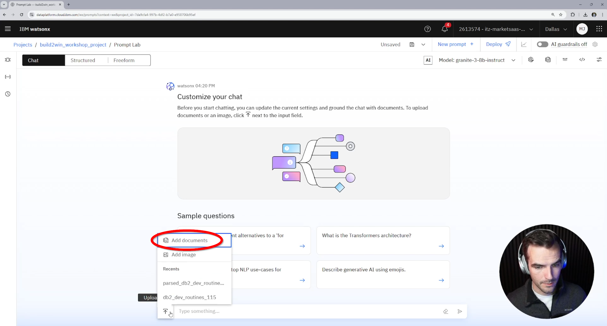

The advanced settings offer a few options, like the embedding model and chunk size and chunk overlap.You can ignore all advanced settings for now. After you clicked "create" watsonx will create the vector database and the embeddings for your documents.

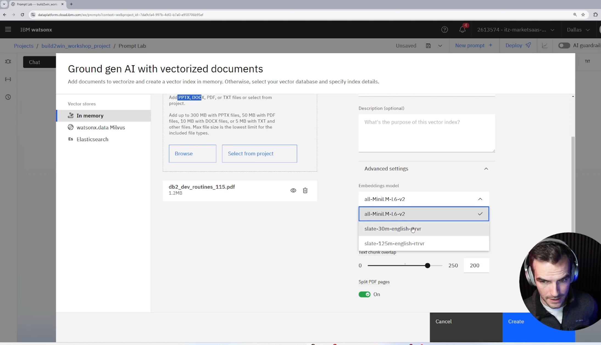

#### 1.2. Chat with your documents

Once the processing is complete you can choose the document you want to chat with. 

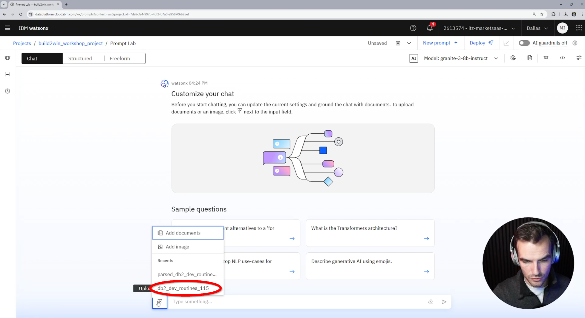

You can also choose the model you want to use for the chat.
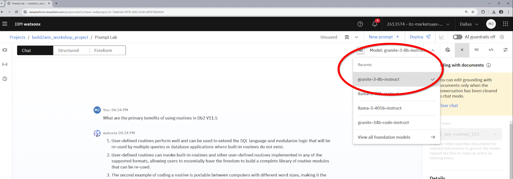

You can also change the system prompt by clicking on the "system prompt" button in the top right corner.

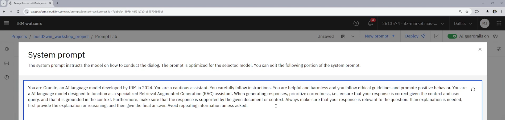

#### 1.3. Inspect the performance of the retriever

The beauty of this approach lies in the modularity and transparency of the system. You can inspect the behaviour of the retriever by looking in your Assets and clicking on the "Vectore Index" with the name of the document(s) you uploaded.

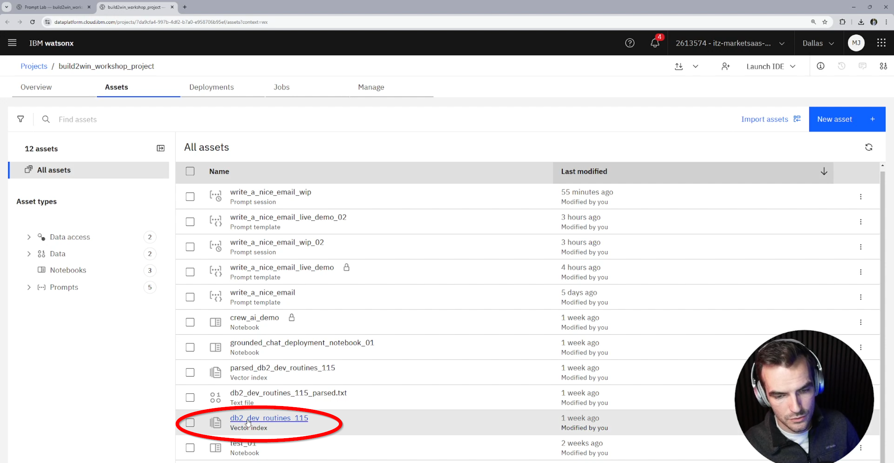

When you ask the same question there you will see the exact chunks that were retrieved from the vector index. You can use this to identify and address issues with the processing of your documents.

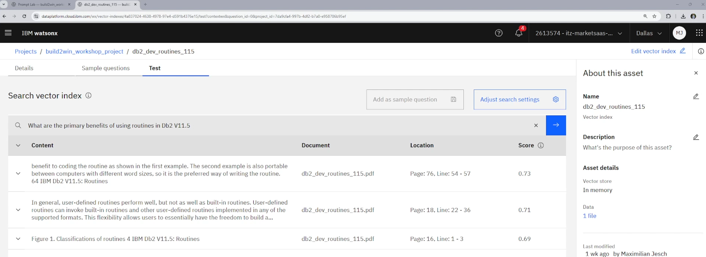

#### 1.4. deploy the RAG system

To deploy the RAG system, you have to go to the chat interface and save your current session as a "deployment notebook"

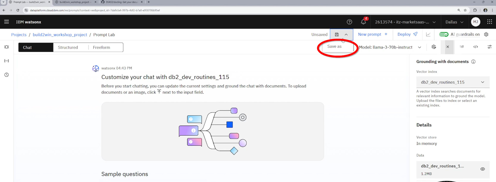
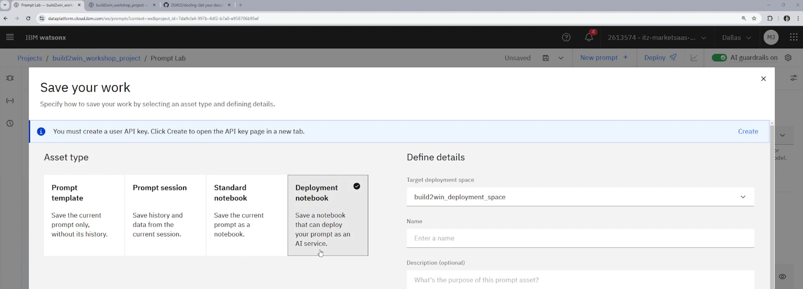

This will create a new asset in your project that you can use to deploy the RAG system in your application. You have to execute the whole notebook to deploy the system.

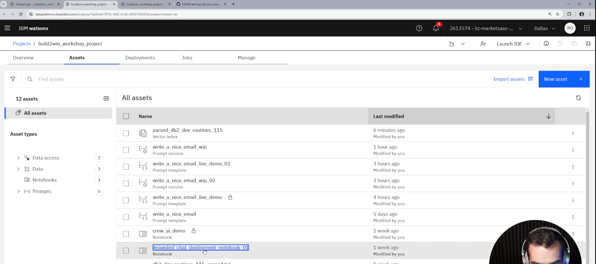

After that you can navigate to the "deployments" tab through the hamburger menu and view your deployed application.

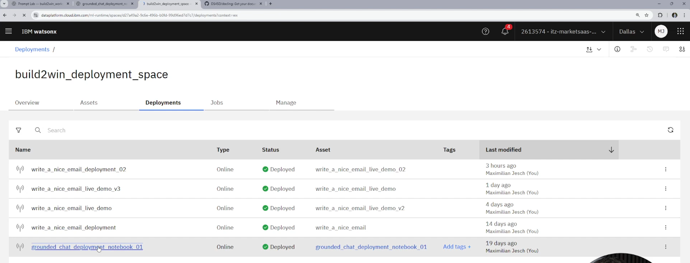

And also find the connection details and code samples to integrate the RAG system in your application.

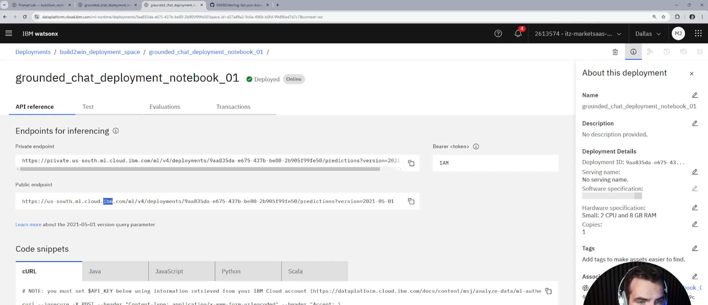

### 2. consume the RAG system

refer to the [frontend app](../00_setup/frontend_app/readme.md) to see how you can consume the RAG system in a custom streamlit app.