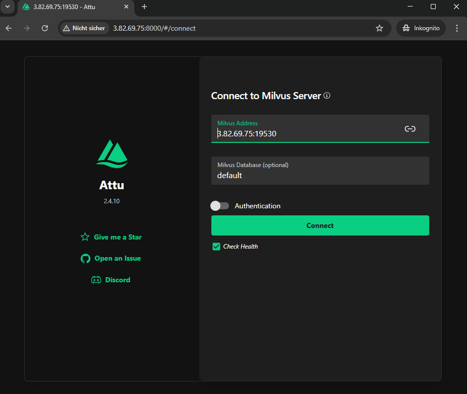

# 

### setup AWS EC2 instance
1. Go to AWS EC2 Console → Click Launch Instances.
2. Set up the instance:
    - Name: milvus_server
    - Instance Type: t2.medium
    - AMI: Choose your OS (Amazon Linux, Ubuntu, etc.).
    - Key Pair: Select or create one for SSH.
    - Networking:
        - just accept the default settings
    - Security Group:
        - Inbound Rules:
            - TCP 9091, 8000, 19530 → 0.0.0.0/0
        - Outbound Rules: Default (Allow all).
3. connect to the instance using SSH (instructions are in the EC2 instance details page)
4. while in the instance, run the following commands:
    4.1 update and install docker
    ```bash
    sudo apt update && sudo apt upgrade -y
    sudo apt install -y docker.io docker-compose
    sudo systemctl start docker
    sudo systemctl enable docker
    sudo usermod -aG docker $USER
    newgrp docker
    ```
    4.2 Start a very basic Milvus server following the instructions here https://milvus.io/docs/de/install_standalone-docker.md:	

    ```bash
    curl -sfL https://raw.githubusercontent.com/milvus-io/milvus/master/scripts/standalone_embed.sh -o standalone_embed.sh
    bash standalone_embed.sh start
    ```
    Now you you should have a Milvus server running on your instance.

    4.3. Install Attu UI 
    ```bash
    docker pull zilliz/attu
    docker run -p 8000:3000 -e MILVUS_URL=localhost:19530 zilliz/attu:latest
    ```
    Now you should be able to access the Attu UI at http://get-your-public-ip-from-aws-ui:8000 (note that this is http not httpS. You might need to manually remove the s from https in the browser). To login use your instance public IP.
    
5. 

