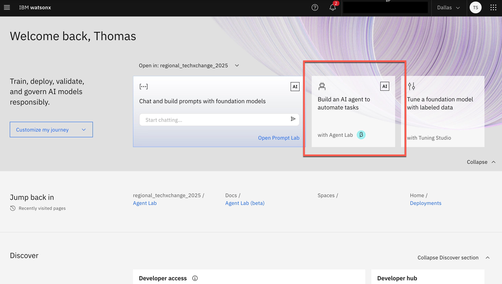
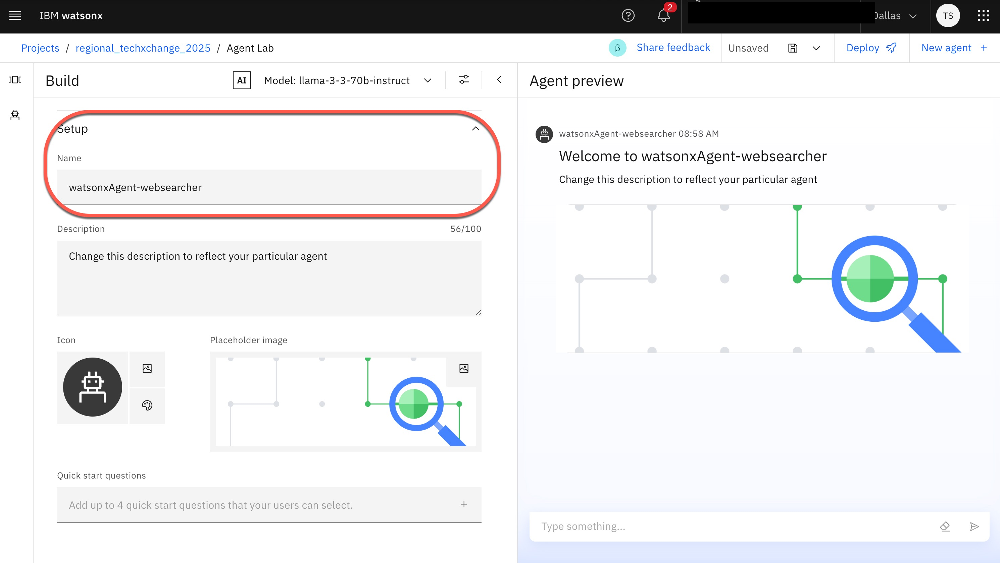
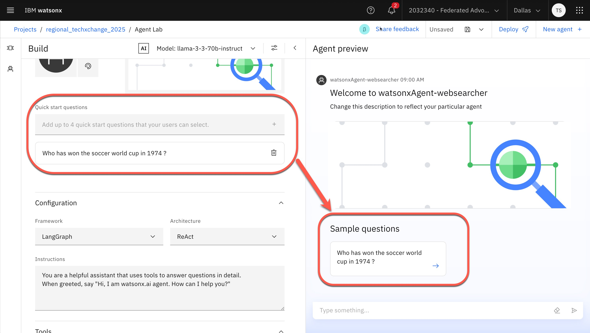
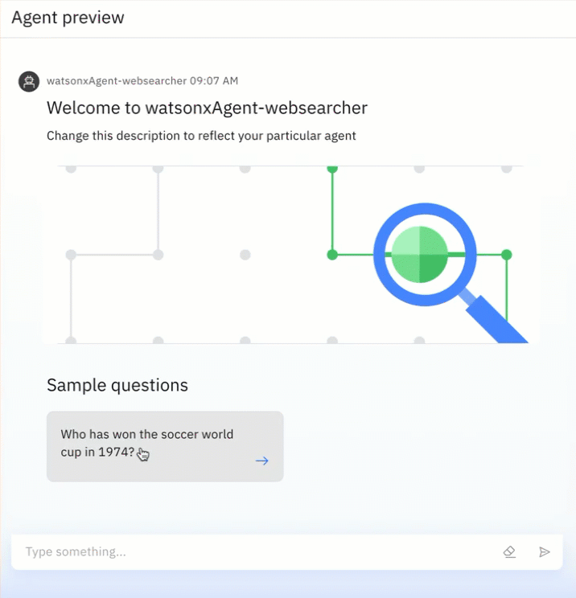
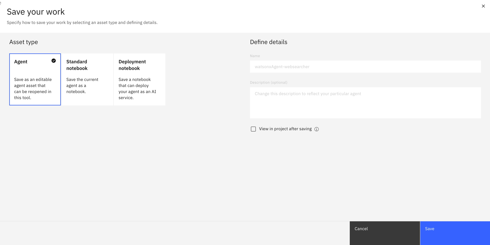

# Create an Agent in the watsonx "Agent Lab" 

[`Link to Workshop Home`](../README.md)

## 1. A step-by-step guide to creating an Agent in the "Agent Lab"

### Step 1: Select "Agent Lab" in watsonx

### Step 2: Define a name

* Name: `watsonxAgent-websearcher`

### Step 3: Create an example starter question

* Question: Who won the soccer World Cup in 1974?

### Step 4: Execute the question

* Just the is the question directly works.

### Step 5: Leave the `Framework`, `Architecture`, and `Instructions` configurations as they are.

### Step 6: Change the web search tool from `Google` to `DuckDuckGo` search

### Step 7: Execute the question again

Here, we see that the answer with this tool is shorter.

### Step 8: Save the Agent

