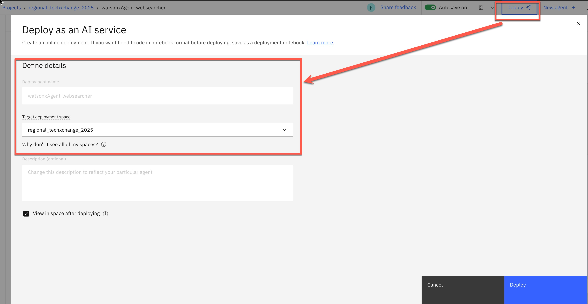

# Deploy an Agent created with the "Agent Lab"

[`Link to Workshop Home`](../README.md)

## 1.  Step-by-step guide to deploy an Agent starting from the "Agent Lab"

### Step 1: Create a deployment space

The GIF below shows a full example of the creation and deployment of a ReAct Agent in the `Agent Lab`:

