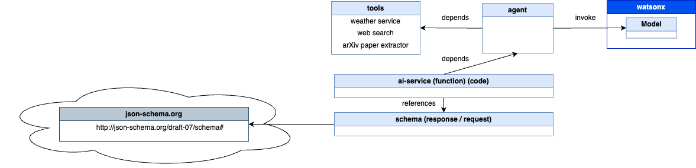
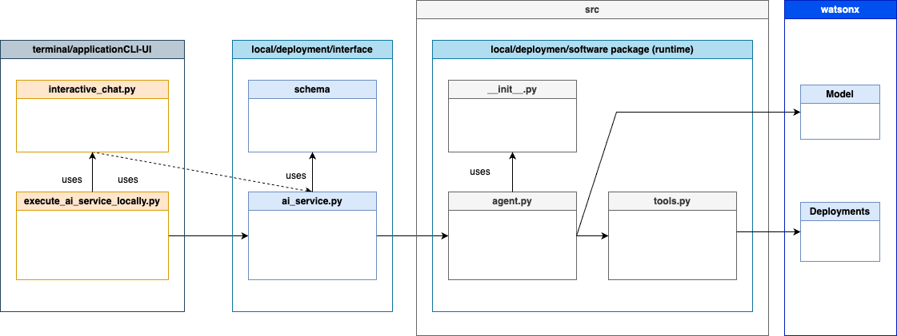
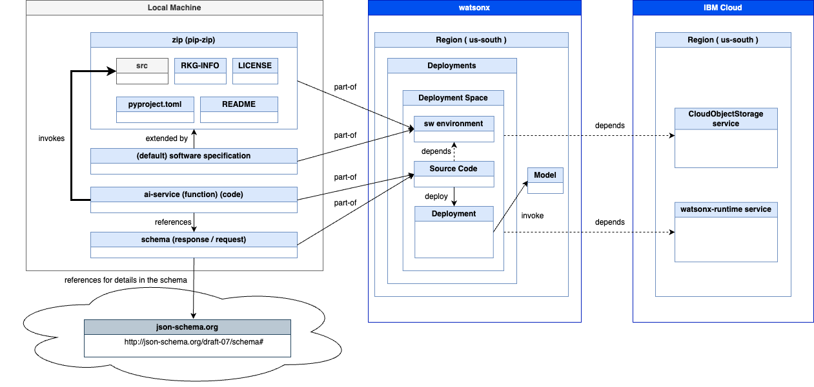

# Build and deploy an AI Agent in watsonx and IBM Cloud

[`Link to Workshop Home`](../README.md)

**Table of contents**

1. Simplified Architecture for the Agent in watsonx and IBM Cloud
2. Setup
3. Test the given `tools` for the Agent
4. Run the Agent locally
5. Deploy the Agent
6. integrate the deployed Agent into a local application

## 1. Simplified Architecture for the Agent in watsonx and IBM Cloud

* Software implementation architecture for an Agent (simplified)



* Software implementation architecture for an Agent (simplified)



* Software deployment of an Agent (simplified)



## 2. Setup

### 2.1. Set up the environment

#### Step 1: Verify the installed Python version

```sh
pyenv versions
pyenv install -l | grep 3.11.9
pyenv install 3.11.9
pyenv global 3.11.9
```

#### Step 2: Install the needed virtual environment

```sh
cd agents/langgraph_implementation
python3.11 -m venv .venv
source ./.venv/bin/activate
python3 -m pip install --upgrade pip
python3 -m pip install poetry
poetry install
```

#### Step 3: Ensure the Python environment  is accessible 

```sh
export PYTHONPATH=$(pwd):${PYTHONPATH}
echo ${PYTHONPATH}
```

#### 2.1.1 Configure the environment

##### Step 1: Configure the `config.toml` file

```sh
cat ./agents/langgraph_implementation/config.toml_template > ./agents/langgraph_implementation/config.toml
```

```sh
[deployment]
 watsonx_apikey = "YOUR_CLOUD_API_KEY"
 watsonx_url = "https://us-south.ml.cloud.ibm.com"  # should follow the format: `https://{REGION}.ml.cloud.ibm.com`
 space_id = "YOUR_SPACE_ID"
 deployment_id = "YOUR_DEPLOYMENT_ID"

[deployment.custom]
# during the creation of deployment, additional parameters can be provided inside the `CUSTOM` object for further referencing
# please refer to the API docs: https://cloud.ibm.com/apidocs/machine-learning-cp#deployments-create
 model_id = "mistralai/mistral-large"  # underlying model of WatsonxChat
 thread_id = "thread-1" # More info here: https://langchain-ai.github.io/langgraph/how-tos/persistence/
 sw_runtime_spec = "runtime-24.1-py3.11"
```

##### Step 2: Configure the `.env` file 

```sh
cat ./agents/langgraph_implementation/src/langgraph_react_agent/.env_template > ./agents/langgraph_implementation/src/langgraph_react_agent/.env
```

```sh
# watsonx-saas-showcase
export WATSONX_REGION=us-south
export WATSONX_APIKEY=YOUR_KEY
export WATSONX_DEPLOYMENT_ID=YOUR_ID
export WATSONX_DEPLOYMENT_ID_RAG=YOUR_RAG_ID
export WATSONX_DEPLOYMENT_ID_EMAIL=YOUR_EMAIL_ID
export WATSONX_SPACE_ID=YOUR_SPACE_ID

# Common
export WATSONX_PUB_DEPLOYMENT_URL="https://${WATSONX_REGION}.ml.cloud.ibm.com/ml/v4/deployments"
export WATSONX_SOFTWARE_NAME="ai_service"
export WATSONX_INSTANCE_ID=XXX
export WATSONX_URL="https://${WATSONX_REGION}.ml.cloud.ibm.com"
export USER_AGENT="0001"
```

## 3. Test the given `tools` for the Agent

```sh
cd agents/langgraph_implementation
source ./.venv/bin/activate
poetry run pytest -rA tests/
```

## 4. Run the Agent locally

```sh
cd agents/langgraph_implementation
source ./src/langgraph_react_agent/.env
source ./.venv/bin/activate
poetry run python examples/execute_ai_service_single_agent_locally.py
```

Possible question:

* "Can you please answer the question, 'What is a DB2 routine?' and then send me a mail I can send to a customer?"


## 5. Deploy the Agent

```sh
cd agents/langgraph_implementation
source ./.venv/bin/activate
poetry run python scripts/deploy_single_agent.py
```

* Final output

Copy the `deployment_id` value.

```sh
-----------------------------------------------------------------------------------------------
Successfully finished deployment creation, deployment_id='a76d3649-d836-4e85-862b-b8e356c99b4a'
-----------------------------------------------------------------------------------------------
```

1. Insert the `deployment_id` value in the [`config.toml` file](./agents/langgraph_implementation/config.toml_template)
2. Insert the `deployment_id` value in the [`.env` file](./ui/code/.env_template) for the Streamlit application. If you already have created the file.


## 6. Integrate the deployed Agent to a local application

### 6.1 CLI application

Example questions:

1) What is a DB2 routine?
2) Can you please create an answer to the question, 'What is a DB2 routine?' and then provide me with a mail I can send to the customer?

```sh
cd agents/langgraph_implementation
source ./.venv/bin/activate
poetry run python examples/query_existing_deployment.py
```

### 6.2 Streamlit application


#### Step 1: Generate an [`.env` file](./ui/code/.env_template) for the application

```sh
cd agents
cat ./ui/code/.env_template > ./ui/code/.env
```

* Content

```sh
# WATSONX
export WATSONX_APIKEY=XXX
export WATSONX_REGION=us-south
export WATSONX_DEPLOYMENT_ID=XXX
export WATSONX_PUB_DEPLOYMENT_URL="https://${WATSONX_REGION}.ml.cloud.ibm.com/ml/v4/deployments"
export WATSONX_SOFTWARE_NAME="ai_service"
export WATSONX_SPACE_ID=XXX
export WATSONX_INSTANCE_ID=XXX
export WATSONX_URL="https://${WATSONX_REGION}.ml.cloud.ibm.com"

# APP
export APP_USER=admin
export APP_PASSWORD=admin
```

### Step 2: Start the application

```sh
cd ui/code
bash start_sdk.sh
```

1. Log on `admin/admin`
2. Ask a question
 Possible question:

 * "Can you please answer the question, 'What is a DB2 routine?' and then send me a mail I can send to a customer?"


## Additional resources

* [watsonx Developer Hub](https://github.com/IBM/watsonx-developer-hub)
* [LangGraph multi agent](https://langchain-ai.github.io/langgraph/how-tos/multi-agent-network/#using-with-a-prebuilt-react-agent)
* [TextChatParameters](https://ibm.github.io/watsonx-ai-python-sdk/fm_schema.html#ibm_watsonx_ai.foundation_models.schema.TextChatParameters)
* [LangChain ChatModels](https://github.com/langchain-ai/langchain-ibm/blob/main/libs/ibm/langchain_ibm/chat_models.py)
* [Develop and Deploy Custom AI Agents to watsonx.ai on IBM Cloud](https://suedbroecker.net/2025/02/25/develop-and-deploy-custom-ai-agents-to-watsonx-ai-on-ibm-cloud/)