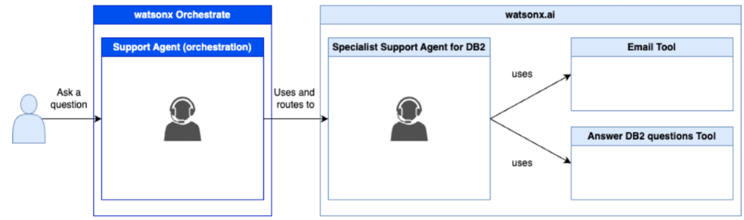
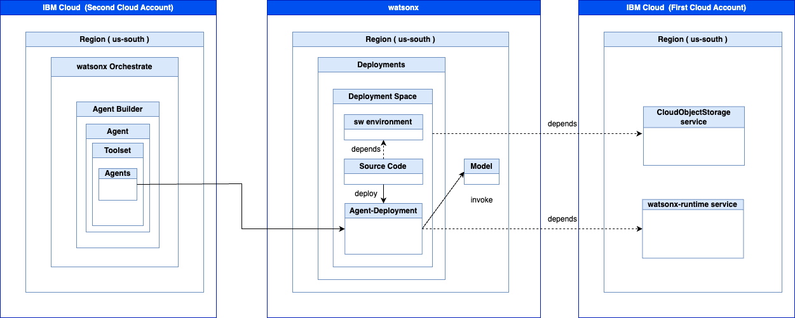

# Custom Agent definition in watsonx Orchestrate

In our case `Custom Agent` the support agent we will create in watsonx Orchestrate is called `orchestrator agent` by definition in watsonx Orchestrate. 

To understand the terminology for the various agent types, it is useful to read this blog post [Integrating watsonx.ai Agents in watsonx Orchestrate](https://heidloff.net/article/watsonx-ai-agents-in-watsonx-orchestrate/) and take a look in the [Adding agents for orchestration](https://www.ibm.com/docs/en/watsonx/watson-orchestrate/current?topic=agents-adding-orchestration). In this context the IBM Think article [`What is AI agent orchestration?`](https://www.ibm.com/think/topics/ai-agent-orchestration) is also useful.

For the details of the setup [Getting Started with Local AI Agents in the watsonx Orchestrate Developer Edition](https://suedbroecker.net/2025/06/25/getting-started-with-local-ai-agents-in-the-watsonx-orchestrate-developer-edition/) is useful.

* Overview multi agents



* Overview Technical



* Local machine integration


## 0. Name

We just call the agent: `Support Agent`

## 1. Profile

Insert following text:

```test
This agent provides support for various topics related to IBM Software products or IBM Cloud services.
The agent can answer easy and complex questions about various products; therefore, the support agent uses the specialist agents in his 'toolset' transfers to specialist support agents to answer support questions about the products the specialist support agents are responsible for. The amount of specialist support agents can change in the future.
```

## 2. Knowledge

Insert following text:

```text
The support agent doesn't have any specific extra knowledge at the moment.
```

## 3. Toolsets

### 3.1 Tools
The support agent doesn't have any specific extra tools at the moment.

### 3.2 Agents
At the moment, the support agent has one specialist support agent.

### 3.2.1 Specialist support agent 

* Name: Support_agent_for_DB2_questions_and_email_outline

* Description:

Insert following text:

```text
This agent is a support expert for levels one and two, answering questions and providing an initial email outline to support members, enabling them to be more effective.

This agent can find the answers to complex questions by accessing DB2 documentation.

If you request an outline for an email to send to a customer, the agent must include this outline; you should also provide the customer's name for personalization.
```

## 4. Behavior

Insert following text:

```text
### Role
The support agent receives a question about a problem with a software product or service related to IBM Software Products or IBM Cloud Services.
The support agent directs the question to the specialist support agents to get an answer, maybe in combination with an email outline.

### Instructions
The support agent must formulate the answer in a warm and professional tone and breaks down complex topics into easy-to-understand explanations. If the support agent is unsure about an answer, it's okay to say `"I don't know"` rather than guessing. 
```

### 5. Preview

Insert following question:

```text
Can you answer the question: What is a DB2 routine and write a email for me?
```

* Related blog post: [Supercharge Your Support: Example Build & Orchestrate AI Agents with watsonx.ai and watsonx Orchestrate](https://suedbroecker.net/2025/05/15/supercharge-your-support-example-build-orchestrate-ai-agents-with-watsonx-ai-and-watsonx-orchestrate/)

