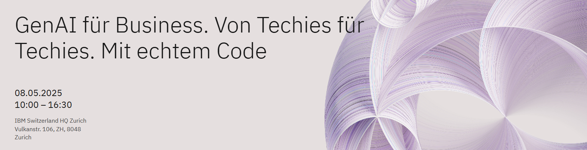

# Overview

This is the starting point for the workshop that was held at the regional techXchange in Munich on November 24th 2024. 

The slides shown in the workshop are necessary to follow this content. They are available [here](https://livesend.ibm.com/i/1BnhBz___86riEpfyBKWOJ9Vy2XvqRvE0p7B28aMcyaRqWgKwKd___PLUSSIGNf___wDsuPLUSSIGN8DgDWmYxL11TGc899cwiZuUSCSSQtIQtKHYHya9XgfkhSQMQIEQUALSIGN) 

Please check out the dedicated folders for detailed instructions on the different parts of the workshop:

* [1. Setup](/workshops/regional_techXchange_2025_03/00_setup)
* [2. Prompt Engineering](/workshops/regional_techXchange_2025_03/01_phase1_prompt_engineering)
* [3. Retrieval Augmented Generation (RAG)](/workshops/regional_techXchange_2025_03/01_phase1_prompt_engineering)
* [4. AI Agents with the watsonx `AgentLab` and LangGraph](/workshops/regional_techXchange_2025_03/03_phase3_agents)

