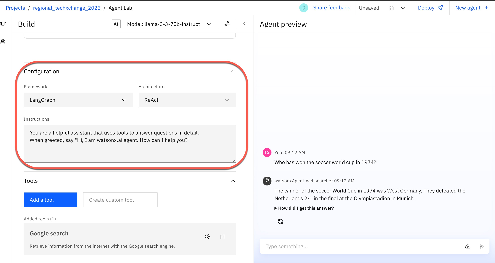
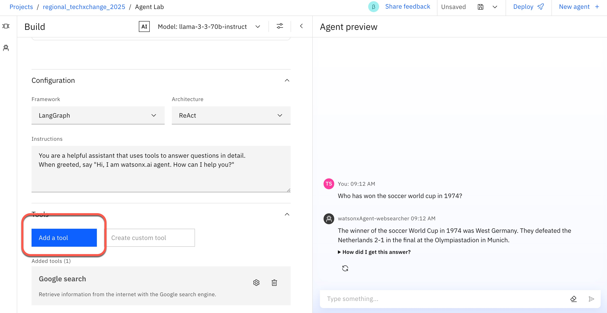
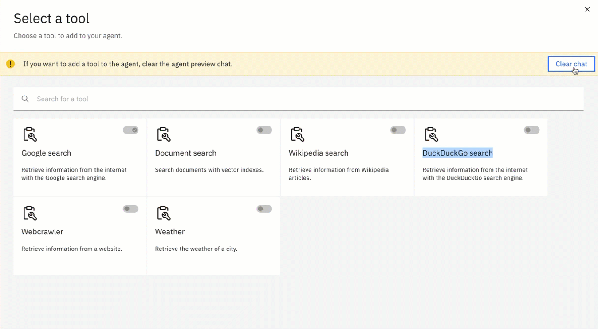
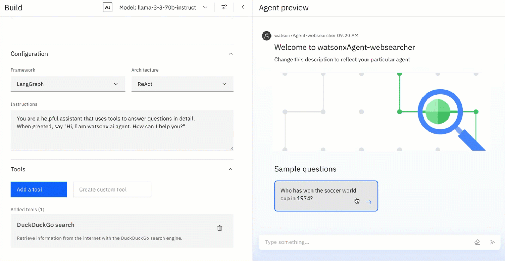
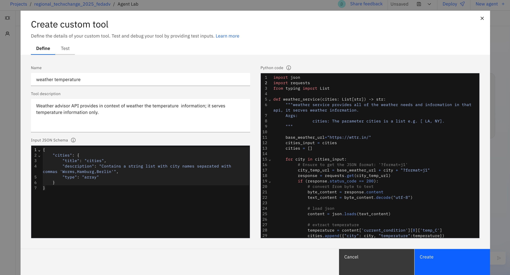
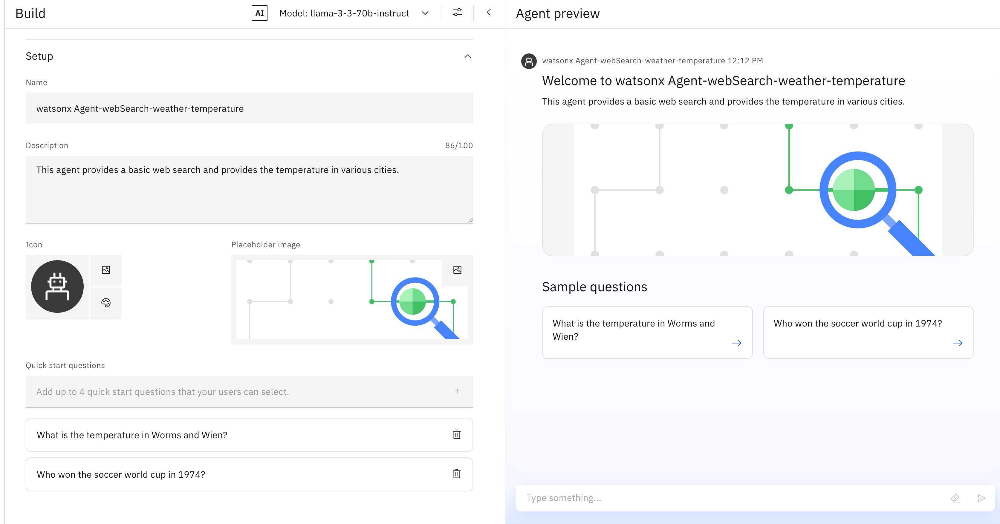
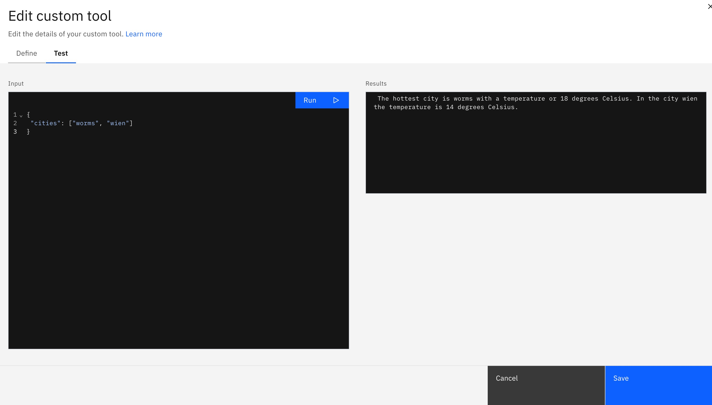

# Create an Agent in the watsonx "Agent Lab" 

[`Link to Workshop Home`](../README.md)

## 1. A step-by-step guide to creating an Agent in the "Agent Lab"

### Step 1: Select "Agent Lab" in watsonx


### Step 2: Define a name

* Name: `watsonxAgent-websearcher`


### Step 3: Create an example starter question

* Question: Who won the soccer World Cup in 1974?


### Step 4: Execute the question

* Just the is the question directly works.


### Step 5: Leave the `Framework`, `Architecture`, and `Instructions` configurations as they are.



### Step 6: Change the web search tool from `Google` to `DuckDuckGo` search





### Step 7: Execute the question again

Here, we see that the answer with this tool is shorter.



### Step 8: Save the Agent


## 2. `Custom Tool` creation

For details please visit the [IBM watsonx documentation for `Custom Tool` creation](https://dataplatform.cloud.ibm.com/docs/content/wsj/analyze-data/fm-agent-custom-tool.html?context=wx&audience=wdp).

* Agent with `Custom Tool`

    * `Agent Name`: watsonx-Agent-webSearch-weather-temperature
    * `Agent Description`: This agent provides a basic web search and provides the temperature in various cities.

### Overview

* Create a `Custom Tool` for the Agent



* Use the `Custom Tool`



* Test the `Custom Tool`



### Step 2: Insert "Name"

* Tool name: weather_temperature

### Step 3: Insert "Tool" description 

* Tool description: This weather advisor API provides in context of weather the temperature information; it serves temperature information only.

### Step 4: Input JSON Schema 

* Input JSON Schema

```JSON
{
    "cities": {
        "title": "cities",
        "description": "Contains a string list with city names separated with commas 'Worms,Hamburg,Berlin'",
        "type": "array"
    }
}
```

### Step 5: Insert the Code

* Code

```Python
import json
import requests
from typing import List

def weather_service(cities: List[str]) -> str:
     """weather service provides all of the weather needs and information in that api, it serves weather information.
     Args:
                cities: The parameter cities is a list e.g. [ LA, NY].
     """
      
     base_weather_url="https://wttr.in/"
     cities_input = cities
     cities = []
      
     for city in cities_input:
          # Ensure to get the JSON format: '?format=j1'
          city_temp_url = base_weather_url + city + "?format=j1"
          response = requests.get(city_temp_url)
          if (response.status_code == 200):      
              # convert from byte to text
              byte_content = response.content
              text_content = byte_content.decode("utf-8")
               
              # load json
              content = json.loads(text_content)
 
              # extract temperature
              temperature = content['current_condition'][0]['temp_C']
              cities.append({"city": city, "temperature":temperature})
          else:
              cities.append({"city": f"{city} ERROR", "temperature":0})
     full_text = ""
     sorted_by_temperature =  sorted(cities, key=lambda x: (x['temperature'], x['city']), reverse=True)
     i = 0
     for city in sorted_by_temperature:
        if (i == 0):
             response_text =  f"The hottest city is {city['city']} with a temperature or {city['temperature']} degrees Celsius."
        else:
             response_text =  f"In the city {city['city']} the temperature is {city['temperature']} degrees Celsius."
        i = i + 1
        full_text = full_text + ' ' + response_text
 
     return full_text
```

* Test

```JSON
{
 "cities": ["worms", "wien"]
}
```

* URL to verify

```sh
https://wttr.in/wien?format=j1
```
