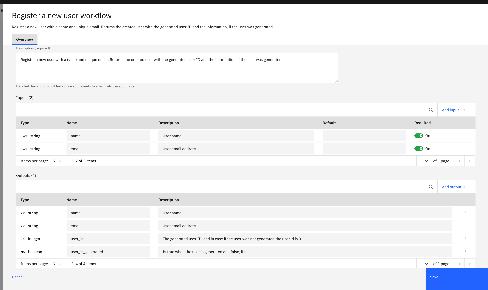
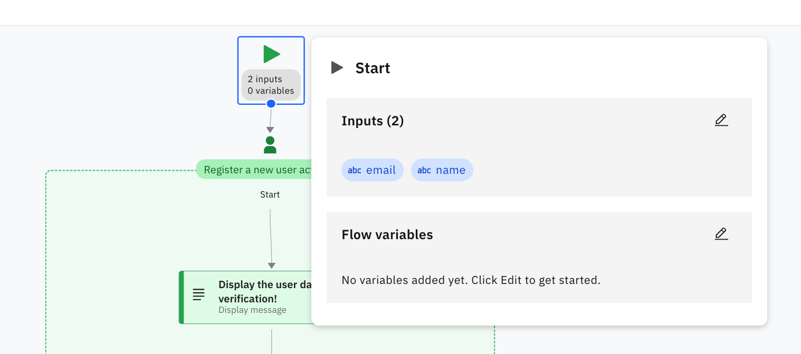
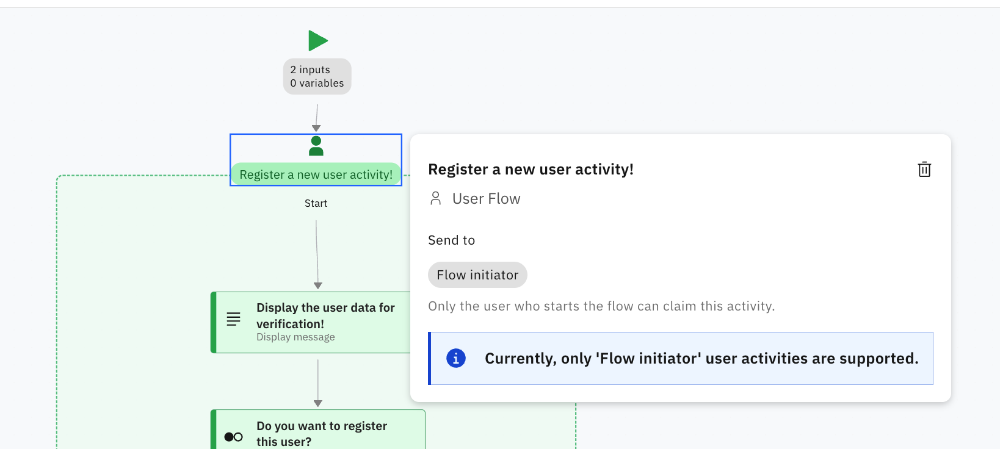
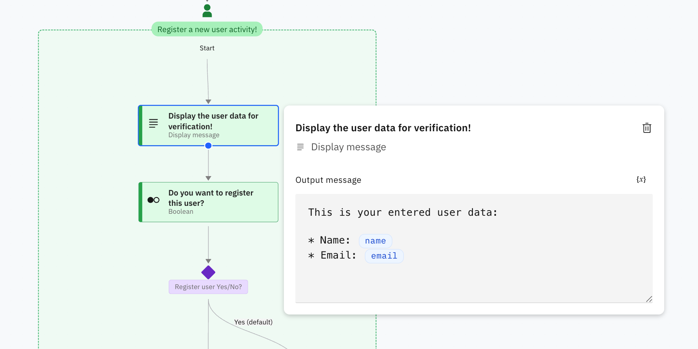
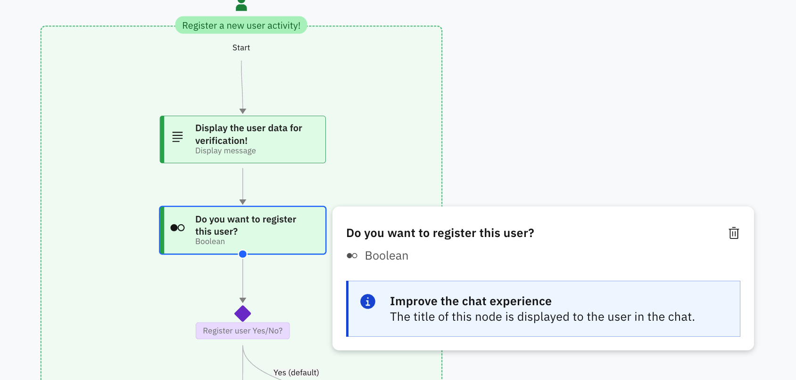
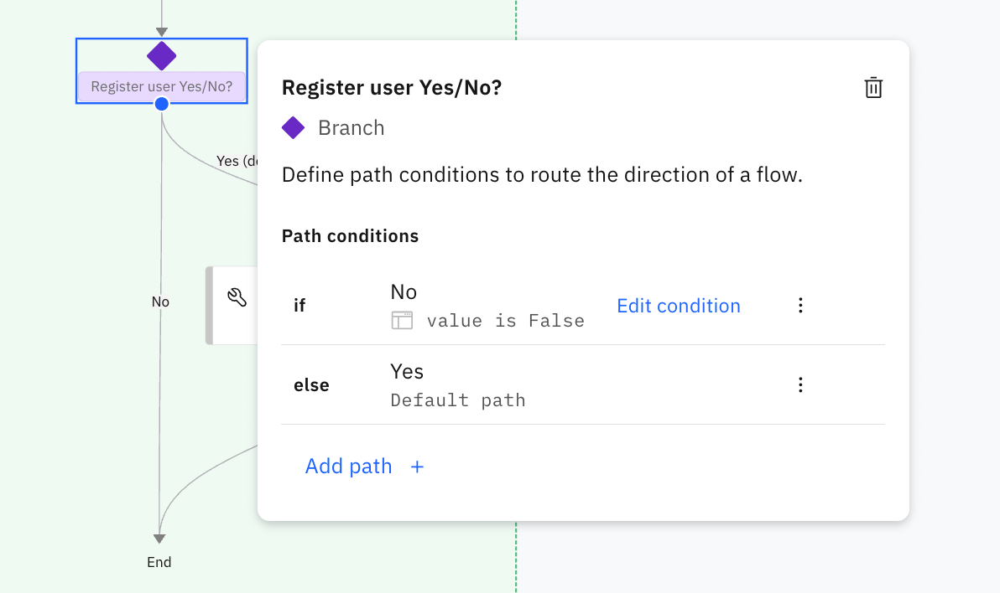
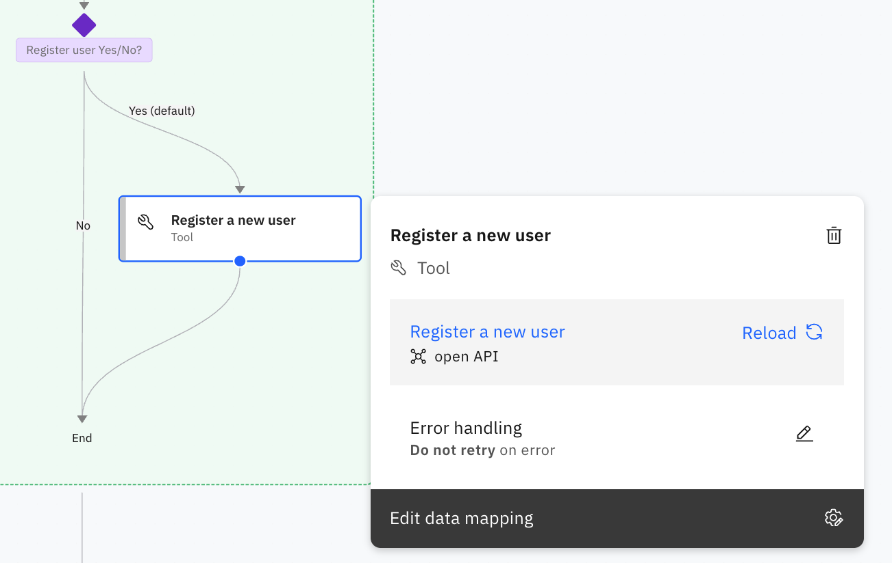
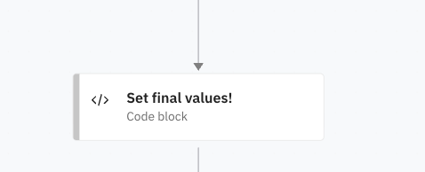
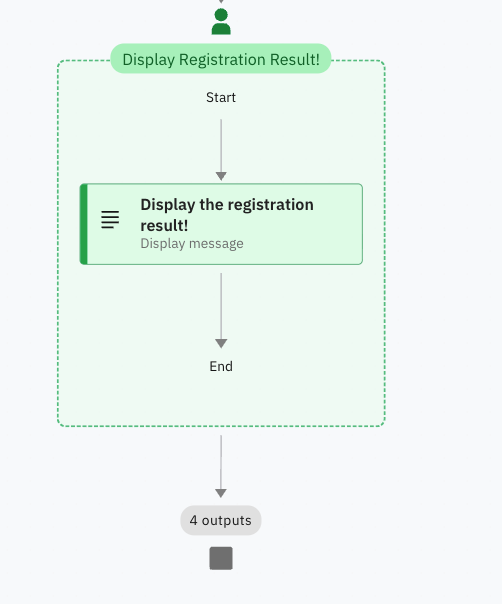
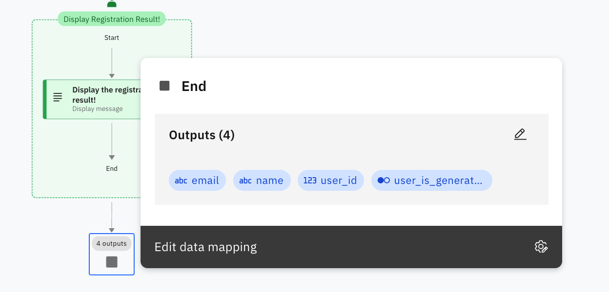

# Workflow

## 1. Workflow defintion

## 2. Input of the flow

## 3. User activity

## 4. Display information to user

## 5. Request input from user

## 6. Use user input to select path

## 7. Use a given tool

## 8. Use custom code to set the result values

## 9. Display the final result

## 10. Flow output

