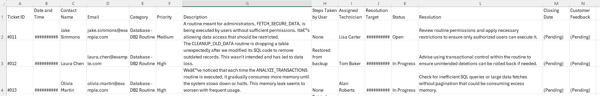

# Basic Setup

This folder contains the basic setup for the workshop. It includes the data, the frontend app and the environment setup.

### Enviroment
TODO: describe how to set this up on thechzone

### Data
To understand the scenario you will need the powerpoint presentation shown in the workshop. This will be available under the following link: [TODO](https://...)

The data provided here is completely fictional and was created mainly by a LLM for the purpose of this workshop. 
The two datasets db2_routines_support_tickets_dataset_01.csv and db2_routines_support_tickets_dataset_02.csv are structurally identical and contain the following columns:

The most important columns are:
- Description: The original text written by the user
- Resolution: The text written by the support agent to resolve the issue.

So this data can be called "labelled" and can also be used for evaluation of the system.

### Frontend App
The frontend app is a simple streamlit app. You can run it locally by executing the following command:

```bash
cd workshops/regional_techXchange_nov24/00_setup/frontend_app
streamlit run app.py
```
You will need the credentials from watsonx to have this app do anything useful.