# chapter 1: The first steps with gen-AI

## Introduction
To follow the scenario of the workshop, you will need the powerpoint presentation shown in the workshop. This will be available under the following link: [TODO](https://...)

This part will be mainly in the watsonx UI. So there will be no code to run.

## Step by Step

### 1. Create a new project
click the plus sign in the top right corner to create a new project.
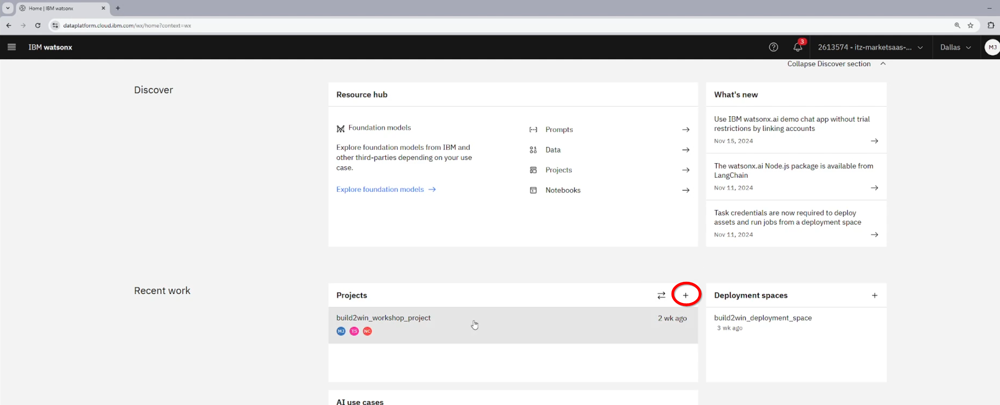

### 2. prompt lab overview

The prompt lab is the IDE for prompt engineering. It offers wide range of different models and interfaces to create prompts and deploy them to use them in your applications.
To navigate to the prompt lab, go into the project and click on "new asset" an then on "prompt lab".
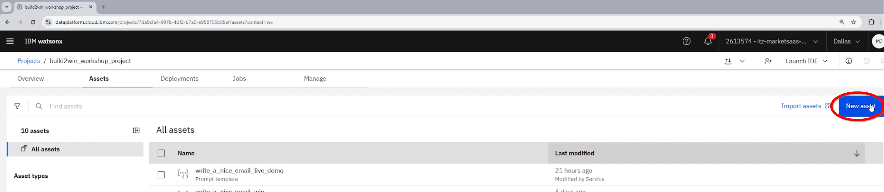

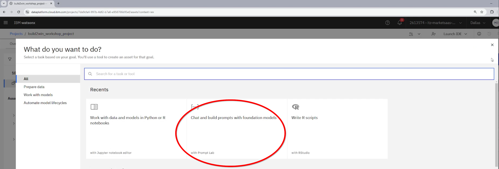
### 2.1. chat interface

The chat interface is the most simple interface to interact with a model. You can just type in your prompt and get a response from the model similar to other well known chatbots like chatGPT or others. While this is convenient, the goal of the prompt lab is not to directly offer a chatbot experience, but to create prompts that can be used in a wide range of applications. This becomes evident in many features that we will discuss in the following sections.

#### 2.1.1. different models
To access the different models, click on the model dropdown in the top right corner.
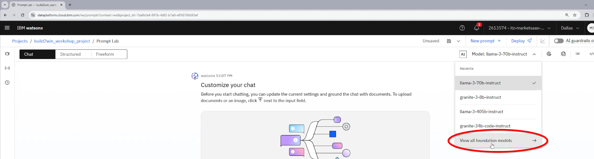

#### 2.1.2. view your prompt 
In any of the different interfaces, you can view your prompt by clicking on the "txt" button in the top right corner.
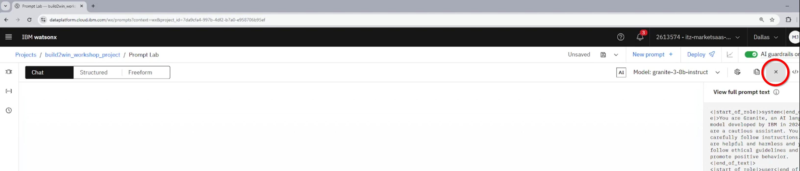

#### 2.1.3. change the system prompt
You can change the system prompt by clicking on the "system prompt" button in the top right corner.
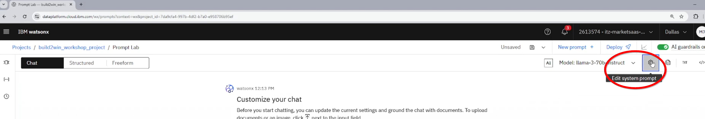

### 2.2. freeform interface 

The freeform interface is the most flexible interface to create prompts. It can be used to simulate a wide range of different ways to interact with a model. 

#### 2.2.1. copy a chat prompt to the freeform interface

When you copy a chat prompt to the freeform interface, you can see the different components of the prompt. This can help you to understand how the prompt is structured and how you can modify it to get different results.

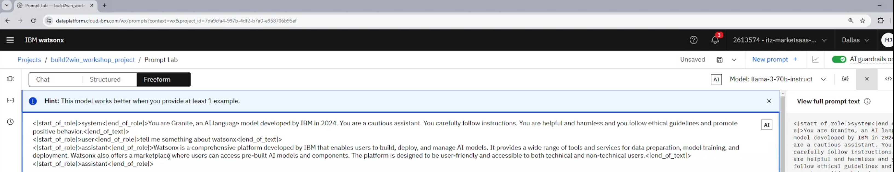

### 2.3. stuctured interface

The structured interface is the most powerful interface to create prompts. At the end it does not do anything different than the other interfaces, but it helps you to structure your prompt in a way that is easy to understand and modify. It is also the easiest way to create prompts that you can deploy and use in your applications.

#### 2.3.1. Prompt Engineering Basics. How hoes the structured interface help you to create a prompt?

the structured interface is designed with common prompt engineering patterns in mind. It promotes the use of instructions, examples and tests to create prompts that are easy to understand and modify.

#### 2.3.2. instructions - examples - tests

In this screenshot you can see how the different componentes of the structured interface are used to create a prompt. The instructions are used to describe the task that the model should perform. The examples are used to show the model how the task can be performed. The tests are used to evaluate the performance of the model. 

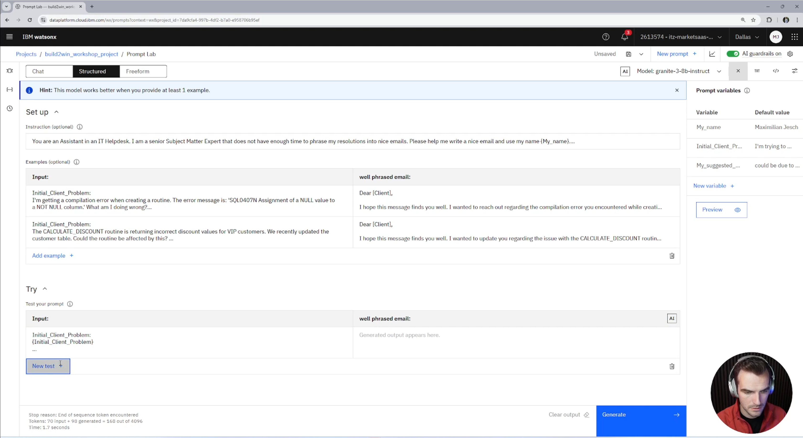

#### 2.3.3. defining variables

To make the prompt do anything useful, you need to define variables. Those variables will then be passed through the API, once deployed, and are the main way to interact with the model.

It is important that you use the first field of the "try" block house your variables. This is the only way to make sure that the variables are passed through the API.

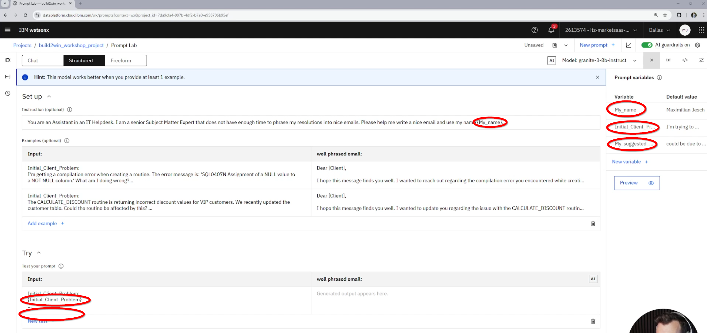

#### 2.3.4. safing and deploying your prompt

Once you are happy with your prompt, you can save it and deploy it. This will make it available to use in your applications.

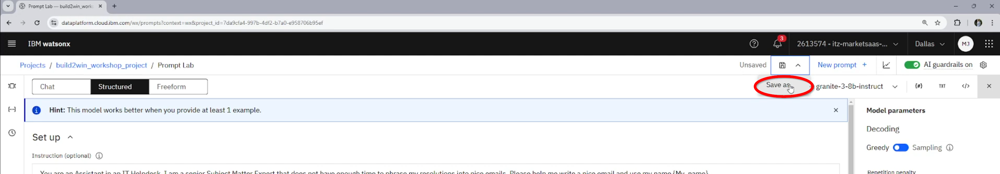

You will need to save your prompt as a "prompt template" and define the task category (this is important for the evaluation of the model, which is not part of this demo).

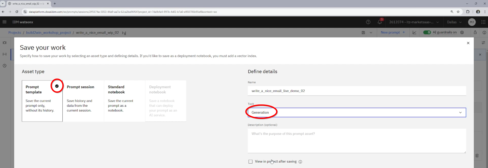

### 3. AI Fact Sheets

AI Fact Sheets are a way to document the AI model that you have created. They are a part of the watsonx.governance portfolio. 

To open the AI Fact Sheets, click on the three dots next to the prompt template and then on "AI Fact Sheet".

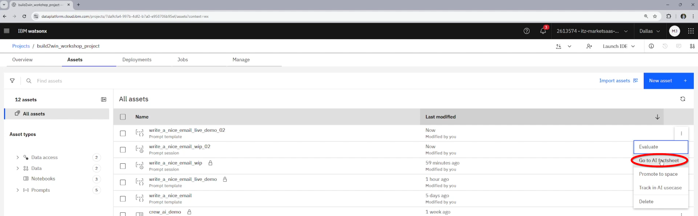

### 4. Deployments

To make your prompt available to use in your applications, you need to deploy it.

to do this you first need to promote your prompt to a "deployment space"
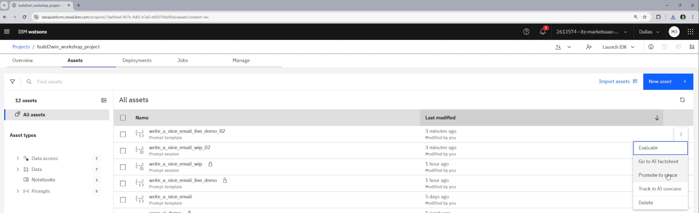

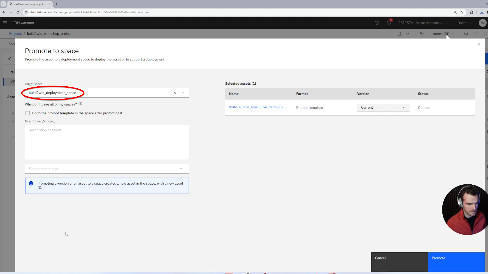

Once you navigate to the deployment space through the hamburger menu, you find your prompt template and do the actual deployment.
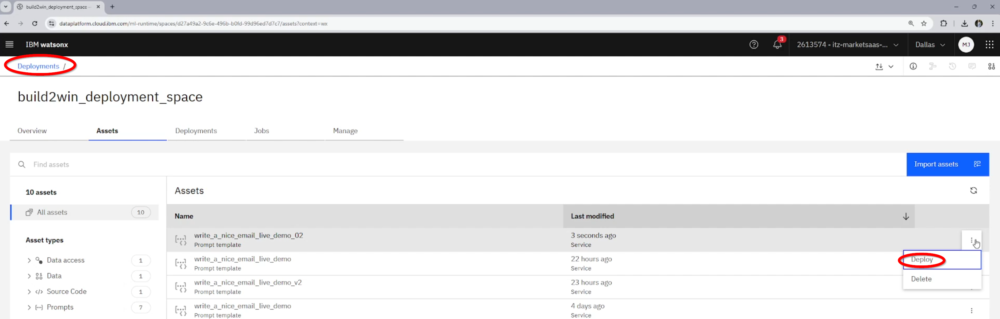

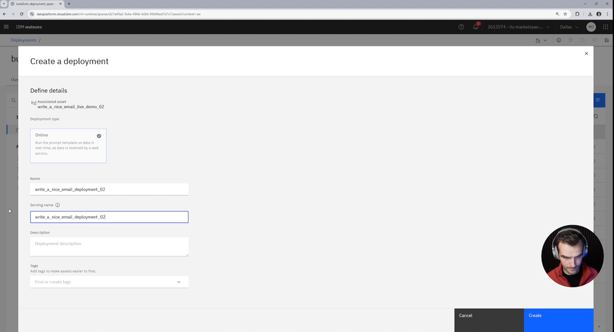

When you navigate to the deployment you can see the API endpoint that you can use to interact with the model.

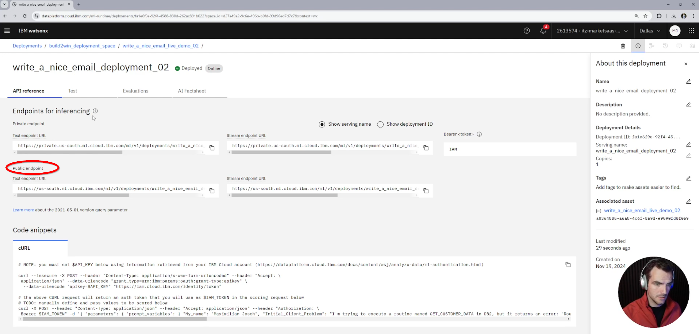

### 5. Consuming with custom streamlit app

refer to the [frontend app](../00_setup/frontend_app/readme.md) to see how you can consume the prompt in a custom streamlit app.

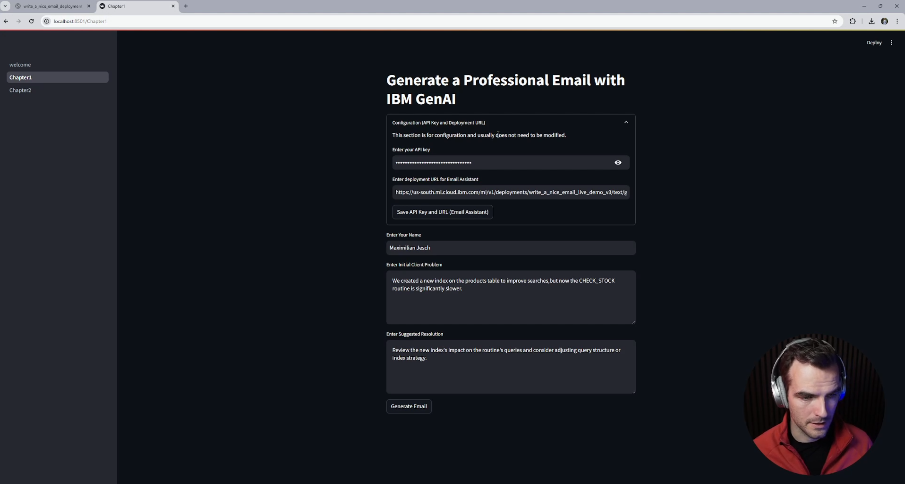